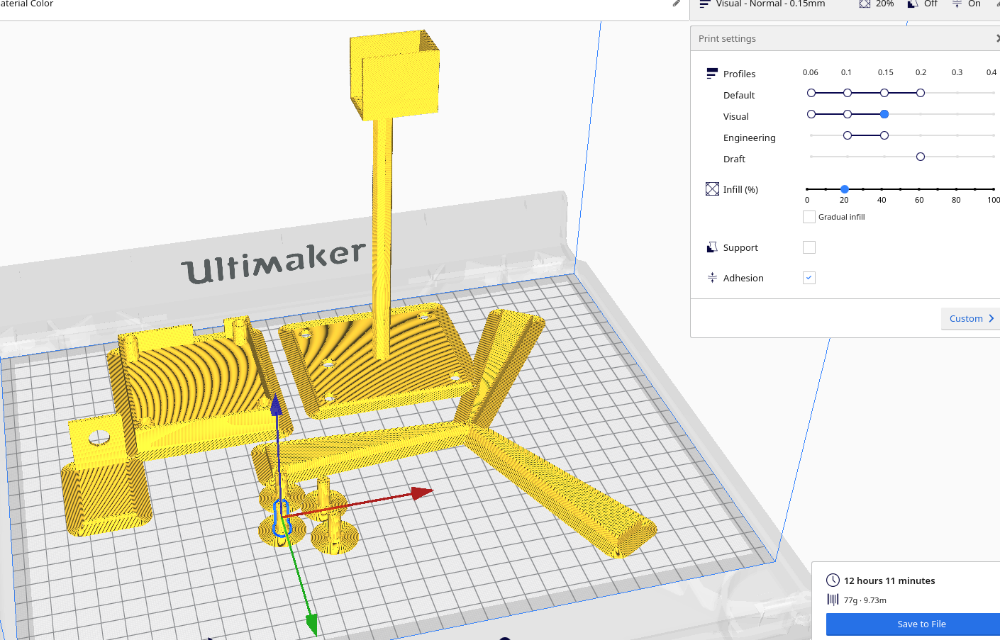
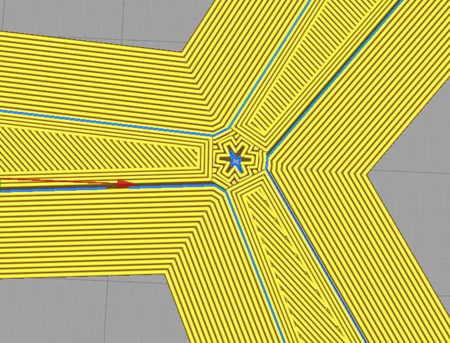

## Description

This is wind generator
contains base, pillar for holding dc motor which will rotate the propeller and you can regulate the power with potenciometer. 
Used Arduino uno R3, potenciometer, DC motor.
You need to install this electronic compound into the 3d model and assemble them with bolts

## Parts List

Base, Motor Pillar(For holding motor), bolts(for assembling base and motor pillar), motor cap (installing it upon the motor using glue), propeller install it in dc motor

## Images

### Circuit

---

## ThingVerse
Link to [THINGIVERSE.COM - 3D printable files](https://www.thingiverse.com/thing:4325654).

## Authors

Aidarbek Zamirbekov COM-17

## Licence

 [GPL-3.0 licensed.](https://github.com/AIDARXAN/Wind_Generator/blob/master/LICENSE)

